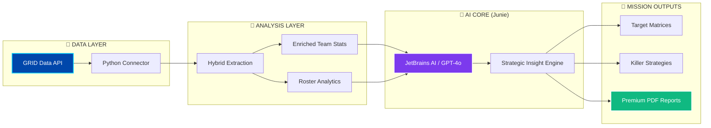

# 🎖️ CLOUD9 STRATOS: AI Strategic Intelligence Hub

 


**Hackathon Category:** Category 2 – Automated Scouting Report Generator  
**License:** MIT License  
**Built with:** JetBrains IDEs and AI Coding Agent **Junie**

---

> **"In the arena, information is the ultimate weapon. Cloud9 Stratos turns raw data into tactical dominance."**

---

## 🚀 Vision & Mission
**Cloud9 Stratos** is a high-performance automated scouting platform engineered for the **Sky’s the Limit - Cloud9 x JetBrains Hackathon**. By fusing real-time **GRID Esports Data** with the deductive reasoning of **JetBrains AI (Junie)**, Stratos provides a tactical advantage that professional coaches (like Nick "Inero" Smith or Ian "Immi" Harding) need to secure the win.

---

## 🧠 System Architecture & Intelligence Flow

Cloud9 Stratos operates on a structured data-to-decision pipeline. Below is the architectural flow of how raw match data is processed into elite strategic intelligence:



### 🛰️ Intelligence Pipeline Breakdown
*   **📡 Data Layer**: Connects directly to the official **GRID API** to pull thousands of raw JSON data points (Series history, Map states, and Match series metadata).
*   **🔬 Analysis Layer**: Our **Hybrid Extraction Engine** cleans and aggregates this raw data, calculating impact scores and team-wide combat ratings.
*   **🧠 AI Core (Junie)**: The enriched stats are injected into the **JetBrains AI (Junie)**. Using advanced deductive reasoning, Junie identifies hidden patterns and playstyle vulnerabilities.
*   **🎯 Mission Outputs**: Translates complex AI logic into actionable coaching tools—**Target Matrices**, **Counter-Strategies**, and **Premium PDF dossiers** ready for the pro stage.

---

## 🔥 Key Features: Tactical Superiority

### 🧠 AI Strategic Intelligence & Analysis
- **⚡ Real-Time Playstyle Detection**: AI analyzes opponent series history to determine if they are early-game aggressors or late-game scalers.
- **🛡️ Killer Counter-Strategies**: Generates a custom-tailored tactical game plan to exploit the specific weaknesses of any opponent found in the GRID database.
- **🎯 Mission-Critical Target Matrix**: Identifies high-threat enemy players and assigns "Alpha Attackers" from your roster to neutralize them.
- **🏆 Battle Verdict Simulation**: Predicts the outcome of matchups by simulating playstyle compatibility and statistical gaps.

### 📄 Premium Strategic Dossiers (PDF)
- **📕 Instant PDF Generation**: Export a professional, mission-ready scouting report with a single click.
- **📊 Data Visualization**: Includes win rates, record history, and combat ratings in a high-readability format.
- **🎨 Premium Branding**: Reports are formatted with a professional, Cloud9-inspired theme suitable for team briefings.

### 🔍 Advanced Scouting & Discovery
- **🏆 Tournament-Locked Recon**: Automatically discovers every team in a specific circuit (LCS, VCT, etc.) using live GRID endpoints.
- **🌍 Global Combat Search**: A fuzzy-matching search engine that can hunt down any professional team across the entire global esports network.
- **🧬 Individual Player Intel**: Deep-dives into individual combat ratings, strengths, and weaknesses to build a complete roster profile.

### 💎 High-End Professional UI
- **🌌 Purple Void Theme**: A custom-designed Glassmorphism interface with neon accents for a triple-A gaming console feel.
- **⚡ Status Monitoring**: Real-time visual updates during high-intensity data extraction from the GRID API.
- **📱 Responsive Navigation**: Scaled navigation tabs and intuitive workflows designed for high-stress coaching environments.

---

## 🛠️ The Technology of Winning

### **The "Agentic" Workflow (JetBrains AI & Junie)**
Developing Cloud9 Stratos required a deep collaboration with **JetBrains AI and the Junie Coding Agent**. Throughout the hackathon, the AI acted as a "Lead Architect":
- **Resilient Data Pipelines**: Built robust parsing logic for GRID's complex JSON exports, ensuring player combat ratings remain consistent.
- **Premium Design System**: Created a custom UI using CSS injection in Streamlit for a premium look.
- **Predictive Modeling**: Worked with Junie to develop the "Tactical Gap" algorithm that reveals hidden vulnerabilities in enemy teams.

### **The Stack**
- **Foundation**: Python 3.10+ & Streamlit
- **Intelligence**: Azure OpenAI GPT-4o (Strategic Engine)
- **Data**: Official GRID Esports Data API
- **Reporting**: Premium FPDF engine with a **Cloud9-inspired theme**.

---

## ⚠️ Mission Constraints (Data Note)
While the **GRID Data API** is the gold standard for esports data, some niche or historic teams may have limited match data available.
- If **GRID** returns insufficient metadata, Stratos intelligently shifts to **System Diagnostics Mode**. 
- This ensures coaches only receive high-confidence AI insights, showing raw data and a warning instead of making inaccurate predictions.

---

## 📋 Installation & Mission Setup

### 1. Secure the Credentials
Create a `.env` file in the root directory (refer to `.env.example`):
```env
GRID_API_KEY=your_grid_key_here
AZURE_OPENAI_KEY=your_azure_key_here
AZURE_OPENAI_ENDPOINT=your_endpoint_here
AZURE_OPENAI_DEPLOYMENT=gpt-4o
```

### 2. Deploy & Launch
```bash
# Enter the source directory
cd try1

# Install requirements
pip install -r requirements.txt

# Start the Command Center
streamlit run app.py
```

---

## 🎖️ Acknowledgements

**Developed with ❤️ and JetBrains IDEs.**
*This system was architected, written, and optimized using the power of JetBrains IDEs and the AI Coding Agent **Junie**. The synergy between developer and AI was the key to delivering this mission-critical scouting system.*

**Sky’s the Limit Hackathon 2026**
*Powered by GRID. Optimized for Victory.*
